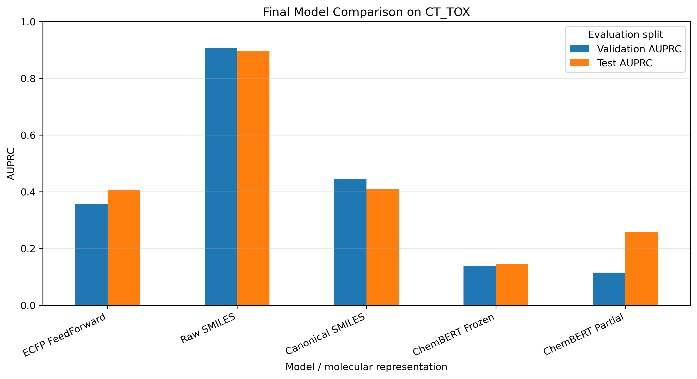

# 🧪 Molecular Machine Learning & ChemBERT

Molecular property prediction using **ECFP fingerprints, SMILES representations, RDKit, PyTorch, DeepChem, and pretrained chemical language models**, with emphasis on representation robustness, class imbalance, and transfer learning.

---

## 🎯 Objectives

This project explores different molecular representations for predicting **compound toxicity (`CT_TOX`)** from the ClinTox dataset.

The workflow was designed to compare conventional molecular fingerprints with learned sequence representations and pretrained chemical language models while explicitly auditing potential representation-dependent shortcuts.

Main objectives:

- Explore molecular datasets using **DeepChem** and **MoleculeNet**
- Compare ECFP, graph-based, and raw molecular representations
- Build an **ECFP + feedforward neural network** baseline
- Train character-level neural representations directly from SMILES
- Audit molecular duplicates, conflicting annotations, and split overlap
- Test the robustness of SMILES-based predictions through **RDKit canonicalization**
- Explore masked molecular language modeling with **ChemBERT**
- Evaluate frozen and partially fine-tuned ChemBERT representations
- Assess performance using imbalance-aware metrics such as **AUPRC**

---

## 🧬 Drug Discovery Context

Predicting molecular toxicity is a central problem in early-stage drug discovery.

Computational toxicity models can help prioritize compounds before expensive experimental testing, but their reliability depends strongly on how molecular structure is represented and how datasets are curated.

SMILES strings are especially useful because they provide compact molecular representations that can be processed using sequence models and pretrained language models. However, the same molecule can be represented by different valid SMILES strings.

This makes representation auditing essential: a model may learn patterns associated with the textual serialization of molecules rather than robust chemical determinants of toxicity.

---

## 📊 Dataset

The project uses the **ClinTox** dataset distributed through MoleculeNet / DeepChem.

For the `CT_TOX` prediction task:

| Split | Samples |
|---|---:|
| Train | 1,184 |
| Validation | 148 |
| Test | 148 |

The training split contains:

- **1,089 negative compounds**
- **95 positive compounds**
- approximately **11.5:1 class imbalance**

Because of this imbalance, model selection focuses primarily on **Area Under the Precision–Recall Curve (AUPRC)** rather than conventional accuracy.

---

## 🧠 Technical Approach

### 1. Molecular Featurization

Multiple molecular representations were explored:

- **ECFP fingerprints** — fixed 1024-dimensional molecular vectors
- **GraphConv** — graph-based molecular objects
- **Weave** — atom- and pair-level molecular representations
- **Raw molecular objects**
- **Character-level SMILES sequences**
- **Canonical SMILES sequences**
- **ChemBERT tokenized molecular sequences**

This comparison illustrates how different molecular representations require different modeling strategies.

---

### 2. ECFP Neural Baseline

A feedforward neural network was trained using **1024-dimensional ECFP fingerprints**.

To address class imbalance:

- positive-class weighting was derived exclusively from the training set
- model checkpoints were selected using **validation AUPRC**
- ROC-AUC, balanced accuracy, precision, recall, and F1 were used as complementary metrics

Test performance:

| Metric | Value |
|---|---:|
| AUPRC | 0.406 |
| ROC-AUC | 0.679 |
| Balanced accuracy | 0.617 |
| F1-score | 0.216 |

This provides a conventional structure-based baseline for subsequent representation experiments.

---

### 3. Masked Molecular Language Modeling

A pretrained **ChemBERT** model was used to explore contextual molecular representations through masked language modeling.

The workflow includes:

- SMILES tokenization
- masked-token prediction
- reconstruction of candidate molecular strings
- RDKit-based validation of reconstructed SMILES

This experiment demonstrates how pretrained chemical language models encode contextual information about molecular sequences before downstream fine-tuning.

---

### 4. Character-Level SMILES Classification

A neural classifier was trained directly on raw SMILES strings using:

- character-level tokenization
- train-derived vocabulary
- embedding layers
- sequence aggregation
- feedforward classification
- class-weighted loss
- validation-AUPRC checkpoint selection

The initial model produced strong apparent test performance:

| Metric | Value |
|---|---:|
| AUPRC | **0.896** |
| ROC-AUC | **0.988** |
| Balanced accuracy | **0.936** |
| F1-score | **0.783** |

Rather than treating this result as definitive, the unusually large improvement over the ECFP baseline motivated a dedicated representation and data-quality audit.

---

## 🔍 Representation & Data-Quality Audit

Molecular structures were canonicalized with **RDKit** to distinguish molecular identity from SMILES serialization.

The audit found:

- **1,165 unique canonical molecules among 1,184 training entries**
- **19 repeated canonical structures**
- all 19 repeated structures had **conflicting class labels**
- **no canonical molecular overlap** between train, validation, and test splits

Additional sequence-level analysis revealed substantial class-associated differences in raw SMILES notation and composition.

To test whether the raw-SMILES classifier depended on these representation-specific patterns, the same modeling strategy was retrained using **canonical SMILES**.

Test AUPRC changed from:

**Raw SMILES: 0.896 → Canonical SMILES: 0.410**

The canonical model remained competitive with the ECFP baseline but no longer reproduced the very high performance observed with raw SMILES.

This control demonstrates that the raw-SMILES result was strongly dependent on representation-specific regularities and should not be interpreted as purely structure-driven predictive performance.

---

## 🤖 ChemBERT Transfer Learning

Two computationally constrained transfer-learning strategies were evaluated.

### Frozen Encoder

The pretrained ChemBERT encoder was frozen and only the classification head was trained.

- Trainable parameters: approximately **0.71%**
- Validation AUPRC: **0.139**
- Test AUPRC: **0.146**

### Partial Fine-Tuning

The final Transformer layer and classification head were made trainable.

- Trainable parameters: approximately **9.20%**
- Validation AUPRC: **0.115**
- Test AUPRC: **0.258**

Neither transfer-learning strategy improved upon the ECFP or canonical-SMILES baselines under the computational constraints of this experiment.

---

## 📈 Final Model Comparison

| Model | Validation AUPRC | Test AUPRC | Test ROC-AUC | Test Balanced Accuracy |
|---|---:|---:|---:|---:|
| ECFP FeedForward | 0.358 | 0.406 | 0.679 | 0.617 |
| Raw SMILES | **0.907** | **0.896** | **0.988** | **0.936** |
| Canonical SMILES | 0.444 | 0.410 | 0.904 | 0.795 |
| ChemBERT Frozen | 0.139 | 0.146 | 0.598 | 0.552 |
| ChemBERT Partial | 0.115 | 0.258 | 0.521 | 0.550 |



The numerically strongest model is therefore **not automatically the most trustworthy model**. The canonicalization experiment shows that the raw-SMILES performance is not robust to an equivalent molecular representation.

---

## 💡 Key Insights

### Molecular representation can dominate apparent performance

Raw SMILES produced dramatically stronger scores than ECFP, but much of this advantage disappeared after canonicalization.

### High performance should trigger validation, not only optimization

The unexpectedly strong raw-SMILES result motivated additional controls rather than immediate model selection.

### Molecular data quality matters

Canonicalization exposed duplicate molecular structures with conflicting labels, highlighting annotation quality as an important source of uncertainty.

### Accuracy is insufficient for imbalanced toxicity prediction

With only 95 positive training examples, AUPRC, balanced accuracy, precision, recall, and F1 provide substantially more useful information than accuracy alone.

### Pretraining does not guarantee downstream improvement

ChemBERT representations did not outperform simpler baselines under frozen or limited fine-tuning, illustrating that transfer learning remains task- and data-dependent.

---

## 🏭 Industry Relevance

The workflow reflects several practical challenges encountered in computational drug discovery:

- **molecular property prediction**
- toxicity prioritization
- molecular representation selection
- imbalanced biological datasets
- chemical data curation
- duplicate and label-conflict detection
- representation-dependent shortcut detection
- pretrained molecular language models
- transfer learning under limited computational resources
- rigorous validation of apparently high-performing models

The project emphasizes not only predictive modeling, but also **model reliability and critical validation**, which are essential when machine-learning outputs are used to support experimental or drug-discovery decisions.

---

## 🛠 Technologies

- Python
- PyTorch
- DeepChem
- RDKit
- Hugging Face Transformers
- ChemBERT
- scikit-learn
- NumPy
- Pandas
- Matplotlib
- JupyterLab
- MoleculeNet / ClinTox

---

## 📁 Project Structure

```text
08-Molecular-ML-ChemBERT/
├── README.md
├── environment.yml
├── notebooks/
│   └── molecular_ml_chembert.ipynb
└── results/
    ├── figures/
    └── tables/
```

The notebook contains the complete experimental workflow, while `results/` stores the main figures, training histories, and model-comparison tables.

---

## 🔁 Reproducibility

Create the Conda environment:

```bash
conda env create -f environment.yml
conda activate molecular-ml-chembert
```

Launch JupyterLab:

```bash
jupyter lab
```

Then open:

```text
notebooks/molecular_ml_chembert.ipynb
```

The project uses fixed train/validation/test splits and validation-based model selection. No test-set metric is used for checkpoint selection.

---

## 🚀 Possible Extensions

Potential next steps include:

- scaffold-based molecular splitting
- explicit duplicate-resolution strategies
- SMILES augmentation with randomized equivalent representations
- alternative molecular foundation models
- graph neural network baselines
- larger-scale ChemBERT fine-tuning with GPU acceleration
- uncertainty estimation and probability calibration
- external validation on independent toxicity datasets

---

## 👩‍🔬 Author

**Salomé Gastaldi, PhD**  
Computational Biology | Bioinformatics | AI for Drug Discovery
