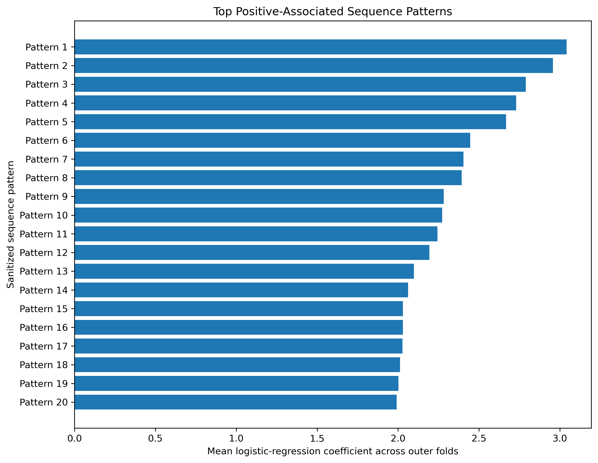
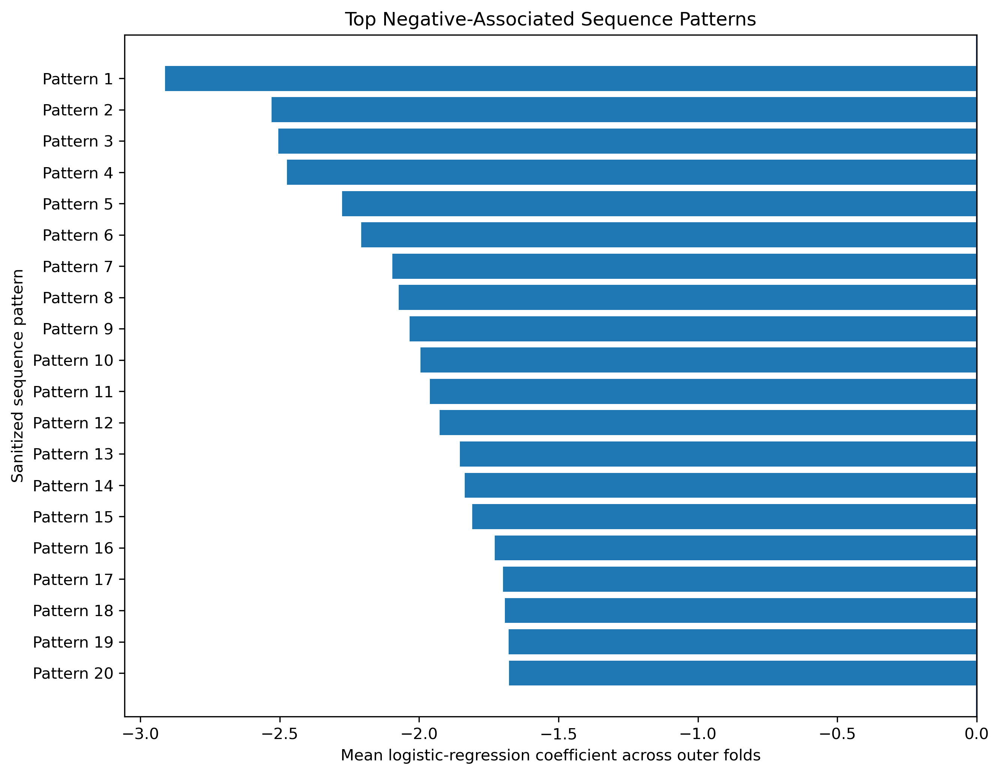
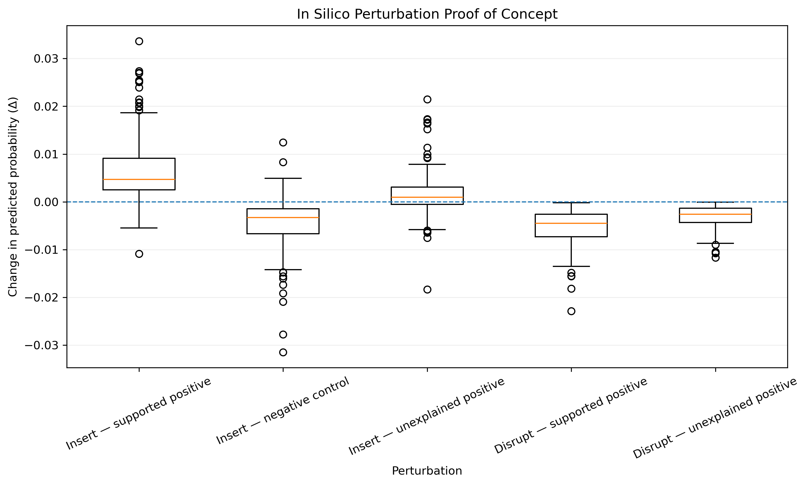

# 🧬 Regulatory DNA Modeling & Interpretable AI

Sequence-based modeling of regulatory DNA using **convolutional neural networks, interpretable k-mer models, rigorous validation, and in silico perturbation**.

This project evaluates whether regulatory DNA sequences contain reproducible predictive signal associated with a binary transcriptional response. The workflow emphasizes generalization, leakage-aware dataset design, class imbalance, statistical validation, interpretability, and reproducibility.

---

## 🎯 Objectives

The project was designed to answer four practical questions:

- Can promoter sequence alone provide predictive information about transcriptional response?
- Does a higher-capacity neural model generalize better than a simpler interpretable representation?
- Is the observed signal distinguishable from chance under permutation testing?
- Which sequence patterns contribute consistently to model predictions?

The analysis combines deep learning with simpler statistical models rather than assuming that greater model complexity necessarily produces better biological prediction.

---

## 🔒 Data Availability and Confidentiality

The original biological dataset and selected external regulatory references are subject to confidentiality restrictions and are not distributed in this public repository.

The public version excludes:

- original promoter sequences
- biological identifiers
- source labels and internal annotations
- non-public regulatory references
- confidential intermediate analysis files
- information that could enable reconstruction of the original industrial dataset

Only sanitized code, aggregated model metrics, public-safe summaries, and non-identifying visualizations are included.

This repository is intended to demonstrate the **computational methodology, validation strategy, and model-interpretation workflow** while preserving data confidentiality.

---

## 🧠 Modeling Strategy

### 1. Dataset Construction and Leakage Control

The sequence dataset was assembled and partitioned into development and independent test sets.

The workflow includes:

- sequence-level quality control
- stratified dataset partitioning
- sequence-similarity auditing
- explicit detection and resolution of potential cross-partition similarity leakage
- independent test isolation during model development

The test set was reserved for final evaluation and was not used for model selection or hyperparameter optimization.

---

### 2. CNN Sequence Model

A convolutional neural network was trained directly on **one-hot encoded promoter sequences**.

The development workflow included:

- class-weight evaluation
- model diagnostics
- validation-based checkpoint selection
- decision-threshold analysis
- independent test evaluation

The selected CNN achieved:

| Dataset | AUPRC | AUROC |
|---|---:|---:|
| Validation | 0.236 | 0.610 |
| Independent test | 0.093 | 0.465 |

The decrease between validation and test performance indicated limited generalization.

This result motivated evaluation of a simpler and more interpretable model rather than further increasing neural-network complexity.

---

### 3. Interpretable k-mer Logistic Regression

Promoter sequences were represented using normalized **k-mer frequencies** and modeled with regularized logistic regression.

Hyperparameter selection and performance estimation were separated using **nested cross-validation**.

For the primary 5-mer representation:

| Metric | Nested CV |
|---|---:|
| Mean AUPRC | 0.194 ± 0.043 |
| Mean AUROC | 0.651 ± 0.041 |

This model showed more consistent generalization than the CNN under the available data regime.

---

## 🧪 Statistical Validation

### Permutation Test

A fixed k-mer model configuration was evaluated against a null distribution generated through **200 label permutations**.

Observed performance:

| Metric | Observed | Empirical p-value |
|---|---:|---:|
| AUPRC | 0.197 | 0.005 |
| AUROC | 0.656 | 0.005 |

No permutation matched or exceeded the observed performance.

The permutation experiment is interpreted as a statistical control for a previously fixed model configuration and does not replace the nested cross-validation procedure used during development.

---

## 📊 Independent Test Evaluation

The final k-mer model was frozen before accessing the independent test set.

No feature selection, hyperparameter tuning, or threshold optimization was performed on test data.

Test performance:

| Metric | Value |
|---|---:|
| AUPRC | 0.184 |
| Random AUPRC baseline | 0.090 |
| AUROC | 0.612 |

At the fixed classification threshold of 0.5, the model produced no positive predictions, resulting in F1 and MCC values of 0.

This illustrates an important distinction between **ranking/discrimination performance** and **threshold-dependent classification performance**, particularly in strongly imbalanced datasets.

---

## 🔬 Model Interpretation

Feature interpretation was performed using only sequence-derived information.

No prior regulatory knowledge, transcription-factor annotations, expression values, or external regulatory evidence were used during model training or feature ranking.

Stable coefficient patterns were identified across the outer cross-validation folds:

| Representation | Stable positive patterns | Stable negative patterns | OOF AUPRC | OOF AUROC |
|---|---:|---:|---:|---:|
| 5-mers | 280 | 304 | 0.195 | 0.655 |
| 6-mers | 1,040 | 1,195 | 0.198 | 0.628 |

Individual k-mer enrichment was also evaluated using Fisher's exact tests with Benjamini–Hochberg correction. No individual k-mer remained significant after multiple-testing correction.

Model coefficients are therefore interpreted as components of a **multivariate predictive signal**, not as independently validated regulatory motifs.

---

## 🔍 Sanitized Sequence-Pattern Analysis

For confidentiality, individual sequence patterns are represented publicly as generic pattern identifiers.

### Positive-associated patterns



### Negative-associated patterns



The public figures preserve ranking and coefficient magnitude while removing the underlying sequence identities.

---

## 🧬 In Silico Perturbation

As a proof-of-concept interpretability experiment, controlled sequence perturbations were evaluated using the frozen k-mer model.

Aggregated results showed directionally consistent responses:

- insertion of a supported positive-associated pattern increased predicted probability in **94.5%** of evaluated promoters
- insertion of a negative-control pattern decreased predicted probability in **88.5%** of cases
- insertion of an additional candidate positive pattern produced the expected direction in **67.5%** of promoters
- disruption of naturally occurring positive-associated patterns decreased predicted probability in all evaluated cases



The absolute probability changes were small. These experiments should therefore be interpreted as evidence of **internal model sensitivity to controlled sequence changes**, not as proof of biological causality or as a promoter-design strategy.

The identities of the evaluated patterns and the external resources used for their prioritization are not distributed.

---

## 💡 Key Insights

### More complex models did not generalize better

The CNN showed moderate validation performance but failed to maintain that signal on the independent test set.

### Simpler models can be more robust in limited-data regimes

The regularized k-mer model provided more consistent out-of-sample performance and a directly interpretable feature representation.

### Validation design matters as much as architecture

Nested cross-validation, similarity auditing, permutation testing, and a held-out test set were essential for separating apparent performance from reproducible predictive signal.

### Imbalanced datasets require appropriate metrics

AUPRC, AUROC, MCC, F1, balanced accuracy, and prevalence-aware baselines provide complementary information that conventional accuracy alone cannot capture.

### Predictive feature importance is not biological causality

Coefficient stability and in silico perturbation characterize model behavior but do not independently validate regulatory mechanisms.

---

## 🏭 Industry Relevance

This workflow reflects practical challenges encountered in computational biology and biotech R&D:

- regulatory DNA modeling
- promoter sequence analysis
- imbalanced biological classification
- leakage-aware dataset design
- model comparison under limited data
- nested cross-validation
- permutation-based statistical validation
- independent test evaluation
- interpretable sequence models
- deep learning model diagnostics
- sequence-level feature interpretation
- in silico perturbation
- analysis under confidentiality constraints

The project emphasizes **robust evidence generation rather than model complexity alone**, with explicit controls for generalization, statistical significance, and interpretation.

---

## 🛠 Technologies

- Python
- PyTorch
- scikit-learn
- NumPy
- Pandas
- SciPy
- Matplotlib
- CD-HIT-EST
- JupyterLab
- Conda

---

## 📁 Project Structure

```text
09-Regulatory-DNA-Interpretable-AI/
├── README.md
├── environment.yml
├── notebooks/
│   └── regulatory_dna_modeling.ipynb
├── scripts/
│   ├── 01_build_dataset.py
│   ├── 02_create_splits.py
│   ├── 02b_audit_sequence_similarity.py
│   ├── 02c_resolve_similarity_leakage.py
│   ├── 03_validate_encoding.py
│   ├── 04_validate_model.py
│   ├── 05_train_baseline.py
│   ├── 06_diagnose_baseline.py
│   ├── 07_pos_weight_ablation.py
│   ├── 08_optimize_threshold.py
│   ├── 09_evaluate_test.py
│   ├── 10_kmer_logistic_nested_cv.py
│   ├── 11_kmer_permutation_test.py
│   ├── 12_interpret_kmer_model.py
│   └── 15_evaluate_kmer_test.py
├── src/
│   ├── data/
│   ├── encoding/
│   ├── evaluation/
│   └── models/
├── data/
│   ├── raw/
│   ├── processed/
│   ├── splits/
│   └── metadata/
├── checkpoints/
└── results/
    ├── figures/
    └── metrics/
```

The modular scripts contain the main computational pipeline, while the notebook provides a concise technical case study of the final methodology and results.

---

## 🔁 Reproducibility

Create the Conda environment:

```bash
conda env create -f environment.yml
conda activate regulatory-dna-interpretable-ai
```

Launch JupyterLab:

```bash
jupyter lab
```

Then open:

```text
notebooks/regulatory_dna_modeling.ipynb
```

The original biological inputs are not publicly distributed, so the full pipeline cannot be reproduced from raw data using this public repository alone.

The included notebook can reproduce the public result summaries and visualizations from the sanitized aggregate outputs distributed under `results/`.

---

## ⚠️ Limitations

Key limitations include:

- limited number of positive examples
- strong class imbalance
- restricted availability of independent biological data
- limited generalization of the evaluated CNN
- threshold calibration limitations
- inability to distribute portions of the original biological dataset and external regulatory resources

The conclusions are specific to the evaluated dataset, modeling strategies, and validation design.

---

## 🚀 Possible Extensions

Potential future directions include:

- larger independent regulatory datasets
- transfer learning from pretrained DNA language models
- partial fine-tuning of genomic foundation models
- calibrated decision-threshold strategies
- model uncertainty estimation
- additional sequence-level attribution methods
- external biological validation of prioritized patterns
- integration with orthogonal regulatory evidence under appropriate data-access controls

---

## 👩‍🔬 Author

**Salomé Gastaldi, PhD**  
Computational Biology | Bioinformatics | AI for Life Sciences
